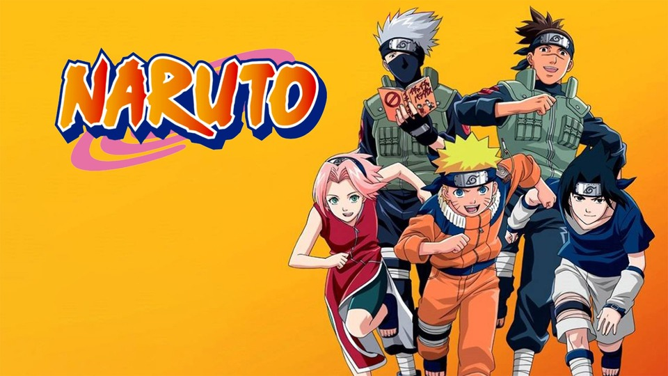

# Naruto

### Manga Canon Episodes:

1-6, 8, 10-13, 17, 22, 25, 31-36, 42, 48, 50-51, 61-62, 64-65, 67-68, 73, 75-82, 84-96, 107-111, 115-125, 128-129, 132-135

### Mixed Canon/Filler Episodes:

7, 9, 14-16, 18-21, 23-24, 27-30, 37-41, 43-47, 49, 52-60, 63, 66, 69-72, 74, 83, 98-100, 112-114, 126-127, 130-131, 141-142, 220

### Filler Episodes:

26, 97, 101-106, 136-140, 143-219

## Naruto Episode List

| Episode Number | Title                                                                     | Type                                                               | Explanation                                                                                                                                                 |
| -------------- | ------------------------------------------------------------------------- | ------------------------------------------------------------------ | ----------------------------------------------------------------------------------------------------------------------------------------------------------- |
| 1              | Enter: Naruto Uzumaki!                                                    |                  |                                                                                                                                                             |
| 2              | My Name is Konohamaru!                                                    |                  |                                                                                                                                                             |
| 3              | Sasuke and Sakura: Friends or Foes?                                       |                  |                                                                                                                                                             |
| 4              | Pass or Fail: Survival Test                                               |                  |                                                                                                                                                             |
| 5              | You Failed! Kakashi's Final Decision                                      |                  |                                                                                                                                                             |
| 6              | A Dangerous Mission! Journey to the Land of Waves                         |                  |                                                                                                                                                             |
| 7              | The Assassin of the Mist                                                  |  |                                                                                                                                                             |
| 8              | The Oath of Pain                                                          |                  |                                                                                                                                                             |
| 9              | Kakashi: Sharingan Warrior                                                |  |                                                                                                                                                             |
| 10             | The Forest of Chakra                                                      |                  |                                                                                                                                                             |
| 11             | The Land Where a Hero Once Lived                                          |                  |                                                                                                                                                             |
| 12             | Battle on the Bridge! Zabuza Returns!                                     |                  |                                                                                                                                                             |
| 13             | Haku's Secret Jutsu: Crystal Ice Mirrors                                  |                  |                                                                                                                                                             |
| 14             | The Number One Hyperactive, Knucklehead Ninja Joins the Fight             |  |                                                                                                                                                             |
| 15             | Zero Visibility: The Sharingan Shatters                                   |  |                                                                                                                                                             |
| 16             | The Broken Seal                                                           |  |                                                                                                                                                             |
| 17             | White Past: Hidden Ambition                                               |                  |                                                                                                                                                             |
| 18             | The Weapons Known as Shinobi                                              |  |                                                                                                                                                             |
| 19             | The Demon in the Snow                                                     |  |                                                                                                                                                             |
| 20             | A New Chapter Begins: The Chunin Exam!                                    |  |                                                                                                                                                             |
| 21             | Identify Yourself: Powerful New Rivals                                    |  |                                                                                                                                                             |
| 22             | Chunin Challenge: Rock Lee vs. Sasuke!                                    |                  |                                                                                                                                                             |
| 23             | Genin Takedown! All Nine Rookies Face Off!                                |  |                                                                                                                                                             |
| 24             | Start Your Engines: The Chunin Exam Begins!                               |  |                                                                                                                                                             |
| 25             | The Tenth Question: All or Nothing                                        |                  |                                                                                                                                                             |
| 26             | Special Report: Live from the Forest of Death                             |                   | Skippable filler recap.                                                                                                                                     |
| 27             | The Chunin Exam Stage 2: The Forest of Death                              |  |                                                                                                                                                             |
| 28             | Eat or Be Eaten: Panic in the Forest                                      |  |                                                                                                                                                             |
| 29             | Naruto's Counterattack: Never Give In!                                    |  |                                                                                                                                                             |
| 30             | The Sharingan Revived: Dragon Flame Jutsu                                 |  |                                                                                                                                                             |
| 31             | Bushy Brow's Pledge: Undying Love and Protection                          |                  |                                                                                                                                                             |
| 32             | Sakura Blossoms!                                                          |                  |                                                                                                                                                             |
| 33             | Battle Formation: Ino-Shika-Cho!                                          |                  |                                                                                                                                                             |
| 34             | Akamaru Trembles: Gaara's Cruel Strength                                  |                  |                                                                                                                                                             |
| 35             | The Scroll's Secret: No Peeking Allowed                                   |                  |                                                                                                                                                             |
| 36             | Clone vs. Clone: Mine are Better Than Yours!                              |                  |                                                                                                                                                             |
| 37             | Surviving the Cut! The Rookie Nine Together Again                         |  |                                                                                                                                                             |
| 38             | Narrowing the Field: Sudden Death Elimination                             |  |                                                                                                                                                             |
| 39             | Bushy Brow's Jealousy: Lions Barrage Unleashed                            |  |                                                                                                                                                             |
| 40             | Kakashi and Orochimaru: Face-to-Face!                                     |  |                                                                                                                                                             |
| 41             | Kunoichi Rumble: The Rivals Get Serious!                                  |  |                                                                                                                                                             |
| 42             | The Ultimate Battle: Cha!                                                 |                  |                                                                                                                                                             |
| 43             | Killer Kunoichi and a Shaky Shikamaru                                     |  |                                                                                                                                                             |
| 44             | Akamaru Unleashed! Who's Top Dog Now?                                     |  |                                                                                                                                                             |
| 45             | Surprise Attack! Naruto's Secret Weapon                                   |  |                                                                                                                                                             |
| 46             | Byakugan Battle: Hinata Grows Bold!                                       |  |                                                                                                                                                             |
| 47             | A Failure Stands Tall!                                                    |  |                                                                                                                                                             |
| 48             | Gaara vs. Rock Lee: The Power of Youth Explodes!                          |                  |                                                                                                                                                             |
| 49             | Lee's Hidden Strength: Forbidden Secret Jutsu!                            |                  |                                                                                                                                                             |
| 50             | The Fifth Gate: A Splendid Ninja is Born                                  |                  |                                                                                                                                                             |
| 51             | A Shadow in Darkness: Danger Approaches Sasuke                            |                  |                                                                                                                                                             |
| 52             | Ebisu Returns: Naruto's Toughest Training Yet                             |  |                                                                                                                                                             |
| 53             | Long Time No See: Jiraiya Returns!                                        |  |                                                                                                                                                             |
| 54             | The Summoning Jutsu: Wisdom of the Toad Sage!                             |  |                                                                                                                                                             |
| 55             | A Feeling of Yearning, A Flower Full of Hope                              |  |                                                                                                                                                             |
| 56             | Live or Die: Risk it All to Win it All!                                   |  |                                                                                                                                                             |
| 57             | He Flies! He Jumps! He Lurks! Chief Toad Appears!                         |  |                                                                                                                                                             |
| 58             | Hospital Besieged: The Evil Hand Revealed!                                |  |                                                                                                                                                             |
| 59             | The Final Rounds: Rush to the Battle Arena!                               |         | Mostly filler but has some connections to the main plot.                                                                                                    |
| 60             | Byakugan vs. Shadow Clone                                                 |  |                                                                                                                                                             |
| 61             | Ultimate Defense: Zero Blind Spot!                                        |                  |                                                                                                                                                             |
| 62             | A Failure's True Power                                                    |                  |                                                                                                                                                             |
| 63             | Hit it or Quit it: The Final Rounds Get Complicated!                      |  |                                                                                                                                                             |
| 64             | Zero Motivation: The Guy with Cloud Envy                                  |                  |                                                                                                                                                             |
| 65             | Dancing Leaf, Squirming Sand                                              |                  |                                                                                                                                                             |
| 66             | Bushy Brow's Jutsu: Sasuke Style!                                         |  |                                                                                                                                                             |
| 67             | Late for the Show, But Ready to Go! The Ultimate Secret Technique is Born |                  |                                                                                                                                                             |
| 68             | Zero Hour! The Destruction of the Hidden Leaf Village Begins!             |                  |                                                                                                                                                             |
| 69             | Village in Distress: A New A-Ranked Mission!                              |  |                                                                                                                                                             |
| 70             | A Shirker's Call to Action: A Layabout No More!                           |  |                                                                                                                                                             |
| 71             | An Unrivaled Match: Hokage Battle Royale!                                 |  |                                                                                                                                                             |
| 72             | A Mistake from the Past: A Face Revealed!                                 |  |                                                                                                                                                             |
| 73             | Forbidden Secret Technique: Reaper Death Seal!                            |                  |                                                                                                                                                             |
| 74             | Astonishing Truth! Gaara's Identity Emerges!                              |  |                                                                                                                                                             |
| 75             | Sasuke's Decision: Pushed to the Edge!                                    |                  |                                                                                                                                                             |
| 76             | Assassin of the Moonlit Night                                             |                  |                                                                                                                                                             |
| 77             | Light vs. Dark: The Two Faces of Gaara                                    |                  |                                                                                                                                                             |
| 78             | Naruto's Ninja Handbook                                                   |                  |                                                                                                                                                             |
| 79             | Beyond the Limit of Darkness and Light                                    |                  |                                                                                                                                                             |
| 80             | The Third Hokage, Forever...                                              |                  |                                                                                                                                                             |
| 81             | Return of the Morning Mist                                                |                  |                                                                                                                                                             |
| 82             | Eye to Eye: Sharingan vs. Sharingan!                                      |                  |                                                                                                                                                             |
| 83             | Jiraiya: Naruto's Potential Disaster!                                     |  |                                                                                                                                                             |
| 84             | Roar, Chidori! Brother vs. Brother!                                       |                  |                                                                                                                                                             |
| 85             | Hate Among the Uchihas: The Last of the Clan!                             |                  |                                                                                                                                                             |
| 86             | A New Training Begins: I Will Be Strong!                                  |                  |                                                                                                                                                             |
| 87             | Keep on Training: Pop Goes the Water Balloon!                             |                  |                                                                                                                                                             |
| 88             | Focal Point: The Mark of the Leaf                                         |                  |                                                                                                                                                             |
| 89             | An Impossible Choice: The Pain Within Tsunade's Heart                     |                  |                                                                                                                                                             |
| 90             | Unforgivable! A Total Lack of Respect!                                    |                  |                                                                                                                                                             |
| 91             | Inheritance! The Necklace of Death                                        |                  |                                                                                                                                                             |
| 92             | A Dubious Offer! Tsunade's Choice                                         |                  |                                                                                                                                                             |
| 93             | Breakdown! The Deal is Off!                                               |                  |                                                                                                                                                             |
| 94             | Attack! Fury of the Rasengan!                                             |                  |                                                                                                                                                             |
| 95             | The Fifth Hokage! A Life on the Line                                      |                  |                                                                                                                                                             |
| 96             | Deadlock! Sannin Showdown                                                 |                  |                                                                                                                                                             |
| 97             | Kidnapped! Naruto's Hot Spring Adventure!                                 |                   | Skippable filler with no ties to the main story.                                                                                                            |
| 98             | Tsunade's Warning: Ninja No More                                          |  |                                                                                                                                                             |
| 99             | The Will of Fire Still Burns                                              |  | Mostly filler, but has some connections to the main story.                                                                                                  |
| 100            | Sensei and Student: The Bond of the Shinobi                               |  |                                                                                                                                                             |
| 101            | Gotta See! Gotta Know! Kakashi-Sensei's True Face!                        |                   | This filler is lighthearted and funny, focused on Team 7 trying to see Kakashi's face.                                                                      |
| 102            | Mission: Help an Old Friend in the Land of Tea                            |                   | Part of the Land of Tea filler arc, introduces new characters but is unrelated to the main story.                                                           |
| 103            | The Race is on! Trouble on the High Seas!                                 |                   | Continuation of the Land of Tea filler arc.                                                                                                                 |
| 104            | Run Idate Run! The Forged Report!                                         |                   | Filler episode in the same arc.                                                                                                                             |
| 105            | A Fierce Battle of Rolling Thunder!                                       |                   | Part of the filler arc, no main story relevance.                                                                                                            |
| 106            | The Last Leg: A Final Act of Desperation                                  |                   | Concludes the Land of Tea filler arc.                                                                                                                       |
| 107            | The Battle Begins: Naruto vs. Sasuke                                      |                  |                                                                                                                                                             |
| 108            | Bitter Rivals and Broken Bonds                                            |                  |                                                                                                                                                             |
| 109            | An Invitation from the Sound                                              |                  |                                                                                                                                                             |
| 110            | Formation! The Sasuke Retrieval Squad!                                    |                  |                                                                                                                                                             |
| 111            | Sound vs. Leaf                                                            |                  |                                                                                                                                                             |
| 112            | Squad Mutiny: Everything Falls Apart                                      |  |                                                                                                                                                             |
| 113            | Full Throttle Power! Choji, Ablaze!                                       |                  |                                                                                                                                                             |
| 114            | Goodbye Old Friend...! I'll Always Believe in You!                        |                  |                                                                                                                                                             |
| 115            | Your Opponent is Me!                                                      |                  |                                                                                                                                                             |
| 116            | 360 Degrees of Vision: The Byakugan's Blind Spot                          |                  |                                                                                                                                                             |
| 117            | Losing is Not an Option!                                                  |                  |                                                                                                                                                             |
| 118            | The Vessel Arrives Too Late                                               |                  |                                                                                                                                                             |
| 119            | Miscalculation: A New Enemy Appears                                       |                  |                                                                                                                                                             |
| 120            | Roar and Howl! The Ultimate Tag Team!                                     |                  |                                                                                                                                                             |
| 121            | To Each His Own Battle                                                    |                  |                                                                                                                                                             |
| 122            | Fakeout: Shikamaru's Comeback!                                            |                  |                                                                                                                                                             |
| 123            | The Leaf's Handsome Devil!                                                |                  |                                                                                                                                                             |
| 124            | The Beast Within                                                          |                  |                                                                                                                                                             |
| 125            | The Sand Shinobi: Allies of the Leaf                                      |                  |                                                                                                                                                             |
| 126            | Showdown: Gaara vs. Kimimaro                                              |                  |                                                                                                                                                             |
| 127            | Vengeful Strike! The Bracken Dance!                                       |                  |                                                                                                                                                             |
| 128            | A Cry on Deaf Ears                                                        |                  |                                                                                                                                                             |
| 129            | Brothers: Distance Among the Uchiha                                       |                  |                                                                                                                                                             |
| 130            | Father and Son, the Broken Crest                                          |  |                                                                                                                                                             |
| 131            | The Secrets of the Mangekyō Sharingan!                                    |  |                                                                                                                                                             |
| 132            | For a Friend                                                              |                  |                                                                                                                                                             |
| 133            | A Plea from a Friend                                                      |                  |                                                                                                                                                             |
| 134            | The End of Tears                                                          |                  |                                                                                                                                                             |
| 135            | The Promise That Could Not Be Kept                                        |                  |                                                                                                                                                             |
| 136            | Deep Cover?! A Super S-Ranked Mission                                     |         | Considered mostly filler, but has small story elements.                                                                                                     |
| 137            | A Town of Outlaws: The Shadow of the Fuma Clan                            |                   | Skippable filler with no major plot relevance.                                                                                                              |
| 138            | Pure Betrayal, and a Fleeting Plea                                        |                   | Continuation of the filler arc.                                                                                                                             |
| 139            | Pure Terror! The House of Orochimaru                                      |                   | Filler episode with no major plot relevance.                                                                                                                |
| 140            | Two Heartbeats: Kabuto's Trap                                             |                   | Skippable filler with no main story connections.                                                                                                            |
| 141            | Sakura's Determination                                                    |  | Continuation of the filler arc.                                                                                                                             |
| 142            | The Three Villains from the Maximum Security Prison                       |  | A new filler arc, you can skip if not interested.                                                                                                           |
| 143            | Ton Ton! I'm Counting on You!                                             |                   | Skippable filler.                                                                                                                                           |
| 144            | A New Squad! Two People and a Dog?!                                       |                   | More filler with no significant ties to the main story.                                                                                                     |
| 145            | A New Formation: Ino-Shika-Cho!                                           |                   | Skippable filler, despite featuring beloved characters.                                                                                                     |
| 146            | Orochimaru's Shadow                                                       |                   | Continuation of the filler arc.                                                                                                                             |
| 147            | A Clash of Fate: You Can't Bring Me Down                                  |                   | Skippable filler, part of the same arc.                                                                                                                     |
| 148            | The Search for the Rare Bikochu Beetle                                    |                   | A new filler arc focused on the Bikochu beetle. Can be skipped.                                                                                             |
| 149            | What's the Difference? Don't All Insects Look Alike?                      |                   | Skippable filler, part of the Bikochu beetle arc.                                                                                                           |
| 150            | A Battle of Bugs! The Deceivers and the Deceived                          |                   | Continuation of the filler arc.                                                                                                                             |
| 151            | Blaze Away, Byakugan! This is My Ninja Way!                               |                   | Concludes the filler arc, no major relevance to the main story.                                                                                             |
| 152            | Funeral March for the Living                                              |                   | Part of the filler arc with the Seven Ninja Swordsmen members.                                                                                              |
| 153            | A Lesson Learned: The Iron Fist of Love                                   |                   | Continuation of the Seven Ninja Swordsmen filler arc.                                                                                                       |
| 154            | The Enemy of the Byakugan                                                 |                   | More filler, focused on the Byakugan.                                                                                                                       |
| 155            | The Dark Creeping Clouds                                                  |                   | Continuation of the filler arc.                                                                                                                             |
| 156            | Raiga's Counterattack                                                     |                   | More filler in the same arc, skippable.                                                                                                                     |
| 157            | Run! The Curry of Life                                                    |                   | A lighthearted filler episode.                                                                                                                              |
| 158            | Follow My Lead! The Great Survival Challenge                              |                   | This filler episode features a survival challenge for new students, with good emotional and educational scenes.                                             |
| 159            | The Bounty Hunter from the Wilderness                                     |                   | Focused on a thief named Gansuki, but can be skipped.                                                                                                       |
| 160            | Hunt or Be Hunted?! Showdown at the O.K. Temple                           |                   | Continuation of the filler arc, still skippable.                                                                                                            |
| 161            | The Appearance of Strange Visitors                                        |                   | Skippable filler, not enjoyable.                                                                                                                            |
| 162            | The Cursed Warrior                                                        |                   | Part of the 161-167 filler arc, skippable with no significant story connections.                                                                            |
| 163            | The Tactician's Intent                                                    |                   | Skippable filler, part of the 161-167 arc.                                                                                                                  |
| 164            | Too Late for Help                                                         |                   | Another skippable filler episode in the 161-167 arc.                                                                                                        |
| 165            | The Death of Naruto                                                       |                   | Skippable filler episode; despite the dramatic title, it has no major story relevance.                                                                      |
| 166            | When Time Stands Still                                                    |                   | Continuation of the filler arc, skippable.                                                                                                                  |
| 167            | When Egrets Flap Their Wings                                              |                   | The conclusion of the 161-167 filler arc, can be skipped.                                                                                                   |
| 168            | Mix It, Stretch It, Boil It Up! Burn Copper Pot, Burn!                    |                   | Skippable filler, focused on Naruto and the ramen chef. Features comedic moments but not important to the main story.                                       |
| 169            | Remembrance: The Lost Page                                                |                   | Skippable filler with no connection to the main story.                                                                                                      |
| 170            | The Closed Door                                                           |                   | Skippable filler with no significant content.                                                                                                               |
| 171            | Infiltration: The Set-Up!                                                 |                   | Filler arc, not connected to the main story.                                                                                                                |
| 172            | Despair: A Fractured Heart                                                |                   | Continuation of the filler arc.                                                                                                                             |
| 173            | The Battle at Sea: The Power Unleashed!                                   |                   | No connection to the main plot.                                                                                                                             |
| 174            | Impossible! Celebrity Ninja Art - Money Style Jutsu                       |                   | Skippable filler with no real impact on the story.                                                                                                          |
| 175            | The Treasure Hunt is On!                                                  |                   | Filler episode focused on a treasure hunt.                                                                                                                  |
| 176            | Run, Dodge, Zigzag! Chase or Be Chased!                                   |                   | Skippable filler with no significant plot development.                                                                                                      |
| 177            | Please, Mr. Postman!                                                      |                   | Another filler episode with no main story relevance.                                                                                                        |
| 178            | Encounter! The Boy with a Star's Name                                     |                   | Part of the filler arc; no connection to the main story.                                                                                                    |
| 179            | The Remembered Lullaby                                                    |                   | Continuation of the filler arc, skippable.                                                                                                                  |
| 180            | Hidden Jutsu! The Price of The Ninja Art: Kujaku                          |                   | Filler with no ties to the main story.                                                                                                                      |
| 181            | Hoshikage: The Buried Truth                                               |                   | No significant impact on the overall plot, can be skipped.                                                                                                  |
| 182            | Reunion: The Remaining Time                                               |                   | Continuation of the filler arc; not relevant to the main story.                                                                                             |
| 183            | The Star's Radiance                                                       |                   | Filler arc concludes, no major story connections.                                                                                                           |
| 184            | Kiba's Long Day                                                           |                   | Focuses on Kiba and Akamaru, skippable filler.                                                                                                              |
| 185            | A Legend from the Hidden Leaf: The Onbaa                                  |                   | This filler episode is humorous, focusing on a strange creature called Onbaa. You can watch if you enjoy comedic moments.                                   |
| 186            | Laughing Shino                                                            |                   | Another comedic filler featuring Shino, but can be skipped.                                                                                                 |
| 187            | Open for Business! The Leaf Moving Service                                |                   | A skippable filler focusing on minor characters.                                                                                                            |
| 188            | Mystery of the Targeted Merchants                                         |                   | No main story relevance, can be skipped.                                                                                                                    |
| 189            | A Limitless Supply of Ninja Tools                                         |                   | Skippable filler without any main plot connections.                                                                                                         |
| 190            | The Byakugan Sees the Blind Spot!                                         |                   | Skippable filler featuring the Hyuuga clan.                                                                                                                 |
| 191            | Forecast: Death! Cloudy with Chance of Sun!                               |                   | Skippable filler with no significant content.                                                                                                               |
| 192            | Ino Screams! Chubby Paradise!                                             |                   | A comedic filler with Ino, you can skip it if you're not interested in humorous filler episodes.                                                            |
| 193            | Viva Dojo Challenge! Youth Is All About Passion!                          |                   | Another skippable comedic filler featuring Lee and Gai.                                                                                                     |
| 194            | The Mysterious Curse of the Haunted Castle                                |                   | A spooky, yet skippable, filler episode.                                                                                                                    |
| 195            | The Third Super-Beast!                                                    |                   | Filler focusing on minor characters, not important to the main story.                                                                                       |
| 196            | Hot-Blooded Confrontation: Student vs. Sensei                             |                   | A filler featuring a face-off between students and sensei. Can be skipped.                                                                                  |
| 197            | Crisis: The Hidden Leaf 11 Gather!                                        |                   | Skippable filler with no main plot relevance.                                                                                                               |
| 198            | The ANBU Gives Up? Naruto's Recollection                                  |                   | Skippable filler.                                                                                                                                           |
| 199            | The Missed Target                                                         |                   | Another skippable filler episode.                                                                                                                           |
| 200            | The Powerful Helper                                                       |                   | Filler without any significant main story details.                                                                                                          |
| 201            | Multiple Traps! Countdown to Destruction                                  |                   | Part of the filler arc, not important to the overall plot.                                                                                                  |
| 202            | The Top 5 Ninja Battles                                                   |                   | Recap-style filler episode, can be skipped.                                                                                                                 |
| 203            | Kurenai's Decision: Squad 8 Left Behind                                   |                   | Skippable filler featuring Kurenai's team.                                                                                                                  |
| 204            | Yakumo's Sealed Power                                                     |                   | Filler episode with no significant story connections.                                                                                                       |
| 205            | Kurenai's Top-Secret Mission: The Promise with the Third Hokage           |                   | Skippable filler.                                                                                                                                           |
| 206            | Genjutsu or Reality?                                                      |                   | Filler arc continues, skippable.                                                                                                                            |
| 207            | The Supposed Sealed Ability                                               |                   | No ties to the main story, can be skipped.                                                                                                                  |
| 208            | The Weight of the Prized Artifact                                         |                   | Skippable filler episode.                                                                                                                                   |
| 209            | The Enemy: Ninja Dropouts                                                 |                   | Another skippable filler arc.                                                                                                                               |
| 210            | The Bewildering Forest                                                    |                   | No connection to the main plot, can be skipped.                                                                                                             |
| 211            | Memory of Flames                                                          |                   | Part of a filler arc, not connected to the main story.                                                                                                      |
| 212            | To Each His Own Path                                                      |                   | Skippable filler episode.                                                                                                                                   |
| 213            | Vanished Memories                                                         |                   | Filler arc with no impact on the overall story.                                                                                                             |
| 214            | Bringing Back Reality                                                     |                   | Skippable filler, no story relevance.                                                                                                                       |
| 215            | A Past to Be Erased                                                       |                   | Skippable filler with no significant content.                                                                                                               |
| 216            | The Targeted Shukaku                                                      |                   | This episode begins a filler arc. While it's not directly related to the main plot, watching from 216-219 helps understand the last canon episode (220).    |
| 217            | Sand Alliance with the Leaf Shinobi                                       |                   | Continuation of the filler arc.                                                                                                                             |
| 218            | The Counterattack!                                                        |                   | Filler, part of the same arc.                                                                                                                               |
| 219            | The Ultimate Weapon Reborn                                                |                   | The final episode in this filler arc.                                                                                                                       |
| 220            | Departure                                                                 |  | This is the final episode of Naruto, with some canon elements towards the end. If you skip the filler arc (216-219), watch episode 220 starting from 12:18. |
